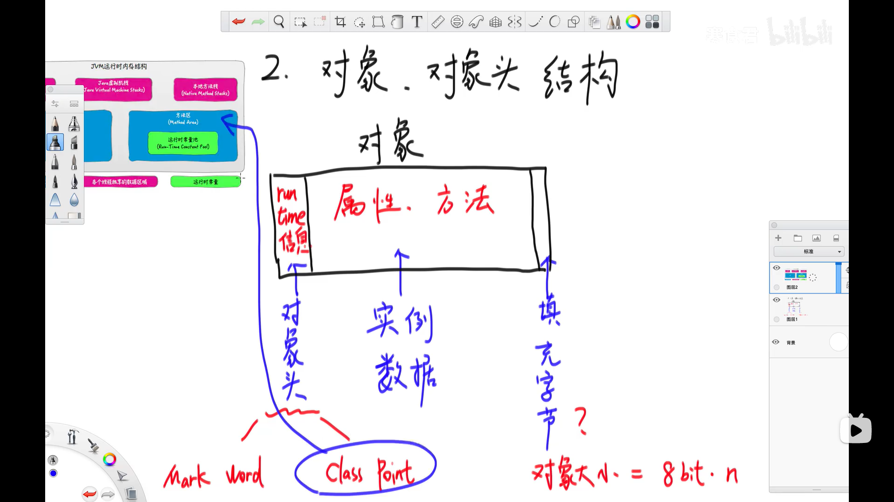
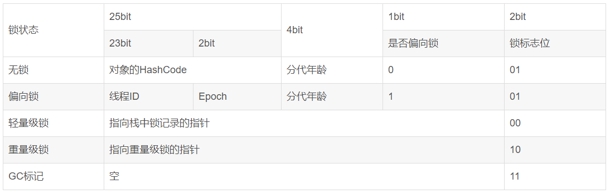
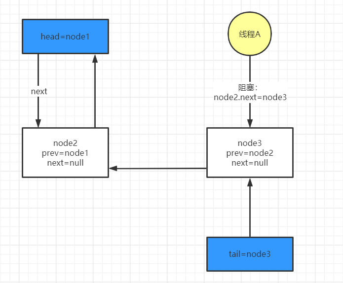
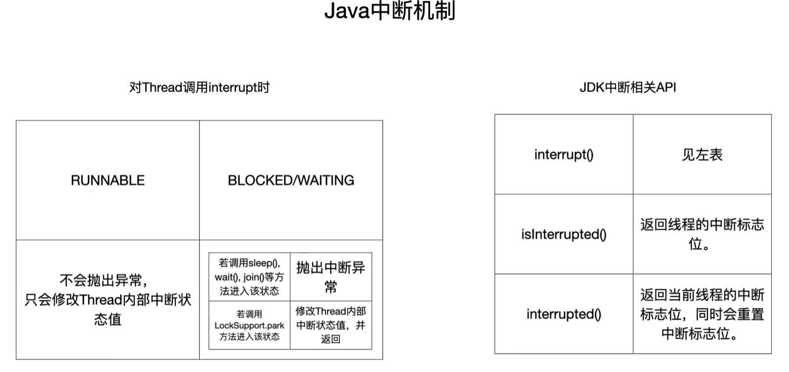
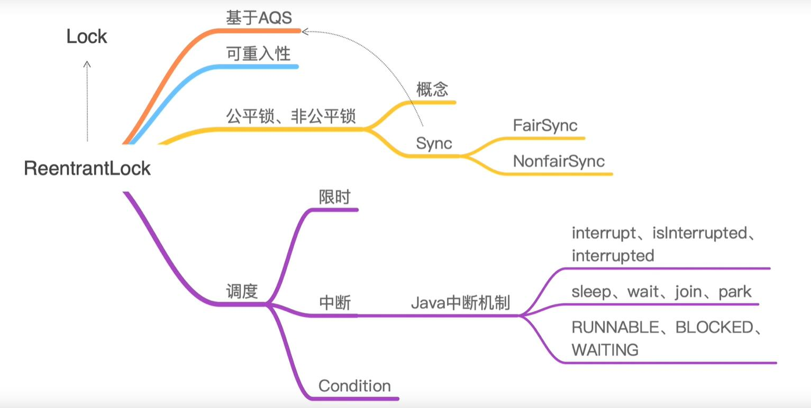

# 第一劫	synchronize


## 1、 synchronize 的使用

```java
package com.logic;

import org.springframework.stereotype.Component;

@Component
public class MyLogic {

    String str = new String("abc");

    // 非静态方法锁（对象锁）
    // 和
    public synchronized void s1() throws InterruptedException {
        System.out.println(Thread.currentThread().getName()+" 非静态方法锁得到资源");
        Thread.sleep(10000);
        System.out.println(Thread.currentThread().getName()+" 非静态方法锁释放资源");
    }

    // 成员锁
    public void s2() throws InterruptedException {
        synchronized (str){
            System.out.println(Thread.currentThread().getName()+" 成员锁得到资源:"+str);
            Thread.sleep(10000);
            System.out.println(Thread.currentThread().getName()+" 成员锁释放资源:"+str);
        }
    }

    // 对象锁(非静态方法锁)
    public void s3() throws InterruptedException {
        synchronized (this){
            System.out.println(Thread.currentThread().getName()+" 对象锁得到资源："+this);
            Thread.sleep(10000);
            System.out.println(Thread.currentThread().getName()+" 对象锁释放资源："+this);
        }
    }

    // 静态方法所（类锁）
    public synchronized static void s4() throws InterruptedException {
        System.out.println(Thread.currentThread().getName()+" 静态方法锁得到资源");
        Thread.sleep(10000);
        System.out.println(Thread.currentThread().getName()+" 静态方法锁释放资源");
    }

}

```


## 2、 总结

1. 对象锁，用来修饰普通代码块
2. 当有线程运行到被 synchronize 修饰的非静态方法时（对象锁），其他线程可以正常访问未被 synchronize 修饰的方法
3. 当有线程运行到被 synchronize 修饰的静态方法时（类锁），可以正常访问未被 synchronize 修饰方法
4. 类也是一个特殊的 java 对象，所以 类锁 和 对象锁 不会互相影响，也就是不会形成同步
5. 非静态方法锁（对象锁） 和 成员锁 不会形成同步，和 对象锁可以形成同步
6. 


## 3.、synchronize 释放锁的情况

1. 程序执行完同步代码块
2. 同步代码块执行出现异常，JVM 会自动释放锁去处理异常


## 4.、synchronize 原理图


# 第二劫	Lock 和 synchronize 的异同


## 1、 两者所处层面不同

- synchronize 是 Java 中的一个关键字，当我们调用它时会从虚拟机指令层面加锁，关键字为 monitorenter 和 monitorexit
- Lock 是 Java 中的一个接口，JDK 5 之后出现，它有许多的实现类来为它提供各种功能，加锁的关键代码大体为 Lock 和 unLock


## 2、获取锁的方式

- synchronize 可对实例方法、静态方法、成员属性 和 代码块 加锁，加锁前


## 3、 等待是否可中断

- synchronize 是不可中断的，除非抛出异常或者运行完
- Lock 是可以中断的


中断方式

- 调用设置超时方法 tryLock(long timeout, timeUnit unit)
- 调用 lockInterruptibly() 放到代码块中，然后调用 interrupt() 方法可以中断


## 4、获取锁失败

- synchronize 获取锁失败的对象会被加入到一个虚拟的等待队列中阻塞，直到锁被释放；1.6 之后加入了自旋
- Lock 获取锁失败的线程会被自动加入到 AQS 的等待队列中自旋，自旋的同时再尝试去获取锁，等到自旋到一定次数并且获取锁操作未成功，线程就会被阻塞


## 5、加锁的时候是否可以公平

- synchronize：非公平锁
- Lock：构造方法可以传入 boolean 值
  - true：公平锁
  - false：非公平锁


## 6、偏向或重入

- synchronize 中叫做偏向锁，当线程访问同步块时，会使用 CAS 将线程 ID 更新到锁的 Mark Word 中，如果更新成功则获得偏向锁，并且之后每次进入这个对象锁相关的同步块时都不需要再次获取锁了。
- Lock 中叫做重入锁，AQS 的实现类 ReentrantLock 实现了重入的机制，若线程 a 已经获得了锁，a 再次请求锁时则会判断 a 是否正持有锁，然后会将原子值 state +1 来实现重入的计数操作。


## 7、总结

1. Lock 是接口，synchronize 是关键字
2. synchronize 会自动释放锁，Lock 必须手动释放锁
3. Lock 可以让等待锁的线程响应中断，而 synchronize 不会，线程会一直等待下去
4. 通过 Lock 可以知道线程有没有拿到锁，而 synchronize 不能
5. Lock 可以提高多个线程的读写操作效率
6. synchronize 能锁住类、方法 和 代码块，而 Lock 是块范围内


# 第三劫	对象结构

## 1、对象结构

​		**[对象结构：脑图](./mind/对象结构.emmx)**


**对象结构**




**MarkWork 的结构**



- 当一个线程想要获得某个对象的锁时。假如看到锁标志位为 00 那么就知道它是轻量级锁，这时线程会在自己的虚拟机栈中开辟一块被称为 Lock Record 的空间。

- 轻量级锁指向栈中锁记录的指针，指向的就是 Lock Record 空间。


# 第四劫	CAS 和锁

## 1、锁的四种状态

- 无锁，顾名思义，就是没有对资源进行锁定。所有线程都能访问该资源。
- 线程状态只能膨胀，也就是 偏向锁--> 重量级锁，不能逆向进行

| 锁名称   | 描述                                                         | 适用场景               |
| -------- | ------------------------------------------------------------ | ---------------------- |
| 无锁     | 非同步代码                                                   | 单线程                 |
| 偏向锁   | 线程在大多数情况下并不存在竞争条件，使用同步会消耗性能，而偏向锁是对锁性能的优化，可以消除同步，提升性能。当一个线程获得锁，会将对象头的锁标志位设为01，进入偏向模式，偏向锁可以在让一个线程一直持有锁，在其他线程需要竞争锁时，再释放锁。 | 只有一个线程进入临界区 |
| 轻量级锁 | 当线程 A 获得偏向锁后，线程 B 进入竞争状态，需要获得线程 A 持有的锁，那么线程 A 撤销偏向锁，进入无锁状态。线程 A 和线程 B交替进入临界区，偏向锁无法满足，膨胀到轻量级锁，锁标志位设为 00 | 多个线程交替进入临界区 |
| 重量级锁 | 当多线程交替进入临界区，轻量级锁 hold 的住。但如果多个线程同时进入临界区，轻量级锁 hold 不住了，膨胀到重量级锁 | 多个线程同时进入临界区 |


## 2、LockRecord

### 1. LockRecord是什么？

- LockRecord 是线程在知道资源带轻量级锁时，在虚拟机栈中开辟的一块空间。

- 当一个线程想要获得某个对象的锁时。假如看到锁标志位为 00 那么就知道它是轻量级锁，这时线程会在自己的虚拟机栈中开辟一块被称为 Lock Record 的空间。

  

轻量级锁指向栈中锁记录的指针，指向的就是 Lock Record 空间。


### 2. LockRecord 里有什么

> ​	The lock record holds the original value of the object’s mark word and also contains metadata necessary to identify which object is locked.
>
> ​	线程通过 CAS 去尝试获取锁，一旦获得将会复制该对象头中的 MarkWord 到 LockRecord 中，并且将 owner 指针指向该对象。

​		

### 3. 轻量锁获取流程

1. 当资源带轻量锁时，线程会通过 CAS 去尝试获取锁，一旦获得将会复制该对象头中的 MarkWord 到 LockRecord 中，并且将 owner 指针指向该对象。
2. 对象的 MarkWord 前 30 bit 将会生成一个指针，指向线程虚拟机栈中的 LockRecord。
3. 这时如果有其他线程获取该资源，会进入自旋等待


### 4. 自旋

- 优点
  - 和被操作系统挂起阻塞相比，如果资源的锁很快被释放，自旋就不需要进行系统终端和现场恢复，所以自旋的效率会高很多
- 缺点
  - 自旋相当于 CPU 空转，如果长时间自旋，非常浪费 CPU 资源


**适应性自旋**

​		自旋的时间不再固定，而是由上一次在同一个锁上的自旋时间以及锁状态 两个条件决定。


## 3、锁的膨胀


1. 偏向锁，轻量锁都是乐观锁，重量级锁是悲观锁
2. 对象刚实例化还没有任何线程访问它的时候，它是可偏向的。当第一个线程来访问它的时候，它会偏向这个线程，此时，对象持有偏向锁。这个线程在修改对象头成为偏向锁的时候使用 CAS 操作，并将 MarkWord 里的线程 ID 改成线程自己的 ID，之后再访问对象的时候，直接比对线程 ID，而不需要 CAS  操作。
3. 当有第二个线程访问这个对象，因为偏向锁不会主动释放，第二个线程看到这个对象时，这个对象处于偏向状态，这个时候检查持有该对象锁的线程是否存活，
   1. 如果挂了，则可以将对象变为无锁状态，然后偏向新的线程
   2. 如果存活，则马上执行那个线程的操作栈，检查该对象的使用情况，
      1. 如果仍然需要持有偏向锁，则将偏向 **锁升级为轻量锁**
      2. 如果不存在使用了，则可以将对象恢复成无锁状态，重新偏向
4. 如果有一个线程正在持有锁，这时候来了第二个线程想获得锁，第二个线程会进入自旋状态
5. 这时候如果又来了第三个线程想获得锁(一个线程在持有，一个线程在自旋)，或者自旋超过一定次数，轻量锁膨胀为重量锁
6. 重量锁使除了拥有锁的线程以为的线程都阻塞，防止 CPU 空转
7. 如果对象

==锁只能膨胀，不能逆向==


## 4、四种状态的优缺点

| 状态     | 优点                                                         | 缺点                                            | 适用场景                           |
| -------- | ------------------------------------------------------------ | ----------------------------------------------- | ---------------------------------- |
| 无锁     | 访问速度快，无消耗                                           | 多线程访问可能出现线程间相互干扰                | 单线程情况下                       |
| 偏向锁   | 加锁和解锁不需要额外的消耗，和执行非同步方法比仅存在比仅存在纳秒级差距 | 如果线程间存在锁竞争，会带来额外的锁撤销的消耗  | 只有一个线程访问同步代码块的场景   |
| 轻量级锁 | 竞争的线程不会阻塞，提高了程序的响应速度                     | 如果始终得不到锁竞争的线程使用自旋会消耗CPU资源 | 追求响应时间，同步块执行速度非常快 |
| 重量级锁 | 线程竞争不使用自旋，不会消耗CPU资源                          | 线程阻塞，响应时间缓慢                          | 追求吞吐量。同步块执行速度较长     |


## 5、CAS

### 1. 对 CAS 的理解

- CAS（CompareAndSwap），即比较并替换。
- CAS需要有3个操作数：内存地址V，旧的预期值A，即将要更新的目标值B。
- 算法过程就是将 A 与 V 对比，如果相等就把 B 写入地址 V


### 2. CAS 的缺点

- 自旋时间长非常浪费 CPU 资源
- 只能保证一个变量的原子操作
- ABA 问题


### 3. 只能保证一个变量的原子操作

当对一个变量执行操作时，我们可以使用循环 CAS 的方式来保证原子操作，但是对多个变量操作时，CAS 目前无法直接保证操作的原子性。


**解决方式**

- 使用互斥锁保证原子性
- 将多个变量封装成对象，通过 AtomicReference 来抱枕原子性


### 4. ABA 问题

**什么是 ABA 问题？**

​	CAS 的使用流程通常如下：

1. 从地址 V 读取值 A
2. 根据 A 计算目标值 B
3. 通过 CAS 以原子的方式将地址 V 中的值从 A 修改为 B


但是在第 1 步中读取的值是 A，并且在第 3 步修改成功了，我们就能说它的值在第 1 步和第 3 步之间没有被其他线程修改过了吗？

如果在这段期间它的值曾经被改成了B，后来又被改回为A，那CAS操作就会误认为它从来没有被改变过。这个漏洞称为CAS操作的“ABA”问题。Java并发包为了解决这个问题，提供了一个带有标记的原子引用类“AtomicStampedReference”，它可以通过控制变量值的版本来保证CAS的正确性。因此，在使用CAS前要考虑清楚“ABA”问题是否会影响程序并发的正确性，如果需要解决ABA问题，改用传统的互斥同步可能会比原子类更高效。


# 第五劫	JUC：AQS

## 1、AQS 概述

AQS：全称：AbstractQueuedSynchronizer，翻译过来就是抽象队列同步器

AQS 属于 package java.util.concurrent.locks 包下。


## 2、成员变量

```java
// 如果等待时间短，选择自旋而非挂起
static final long spinForTimeoutThreshold = 1000L;

// 序列化用，没啥好说的
private static final long serialVersionUID = 7373984972572414691L;

// 既然 AQS 是队列，那么当然有头节点和尾节点了
private transient volatile Node head;
private transient volatile Node tail;

// 同步状态，也就是锁是否被获取
// state > 0：锁被占用，且只能被单个线程占用
// state = 0：锁被释放
private volatile int state;
```


## 3、静态类

### 1. 静态类：Node


**主要属性介绍**

```java
// 标记，指示一个节点正在共享模式下等待
static final Node SHARED = new Node();

/** 标记，指示节点正在独占模式下等待 */
static final Node EXCLUSIVE = null;

/** waitStatus 状态
	1. 表示当前结点已取消。当timeout或被中断（响应中断的情况下），会触发变更为此状态，进入该状态后的结点将不会再变化。
	-1.表示后继结点在等待当前结点唤醒。后继结点入队时，会将前继结点的状态更新为SIGNAL
	-2.表示结点等待在Condition上，当其他线程调用了Condition的signal()方法后，CONDITION状态的结点将从等待队列转移到同步队列中，等待获取同步锁
	-3.共享模式下，前继结点不仅会唤醒其后继结点，同时也可能会唤醒后继的后继结点。
	0. 新结点入队时的默认状态
*/
static final int CANCELLED =  1;
static final int SIGNAL    = -1;
static final int CONDITION = -2;
static final int PROPAGATE = -3;

// 等待状态
volatile int waitStatus;

// 前指针
volatile Node prev;
// 后指针
volatile Node next;
// 线程对象
volatile Thread thread;

/** 返回上一个结点，如果上一个结点为空，报 NullPointerException */
final Node predecessor() throws NullPointerException {
    Node p = prev;
    if (p == null)
        throw new NullPointerException();
    else
        return p;
}
```


**详细介绍**

```java
/**
     * Wait queue node class.
     *
     * <p>The wait queue is a variant of a "CLH" (Craig, Landin, and
     * Hagersten) lock queue. CLH locks are normally used for
     * spinlocks.  We instead use them for blocking synchronizers, but
     * use the same basic tactic of holding some of the control
     * information about a thread in the predecessor of its node.  A
     * "status" field in each node keeps track of whether a thread
     * should block.  A node is signalled when its predecessor
     * releases.  Each node of the queue otherwise serves as a
     * specific-notification-style monitor holding a single waiting
     * thread. The status field does NOT control whether threads are
     * granted locks etc though.  A thread may try to acquire if it is
     * first in the queue. But being first does not guarantee success;
     * it only gives the right to contend.  So the currently released
     * contender thread may need to rewait.
     *
     * <p>To enqueue into a CLH lock, you atomically splice it in as new
     * tail. To dequeue, you just set the head field.
     * <pre>
     *      +------+  prev +-----+       +-----+
     * head |      | <---- |     | <---- |     |  tail
     *      +------+       +-----+       +-----+
     * </pre>
     *
     * <p>Insertion into a CLH queue requires only a single atomic
     * operation on "tail", so there is a simple atomic point of
     * demarcation from unqueued to queued. Similarly, dequeuing
     * involves only updating the "head". However, it takes a bit
     * more work for nodes to determine who their successors are,
     * in part to deal with possible cancellation due to timeouts
     * and interrupts.
     *
     * <p>The "prev" links (not used in original CLH locks), are mainly
     * needed to handle cancellation. If a node is cancelled, its
     * successor is (normally) relinked to a non-cancelled
     * predecessor. For explanation of similar mechanics in the case
     * of spin locks, see the papers by Scott and Scherer at
     * http://www.cs.rochester.edu/u/scott/synchronization/
     *
     * <p>We also use "next" links to implement blocking mechanics.
     * The thread id for each node is kept in its own node, so a
     * predecessor signals the next node to wake up by traversing
     * next link to determine which thread it is.  Determination of
     * successor must avoid races with newly queued nodes to set
     * the "next" fields of their predecessors.  This is solved
     * when necessary by checking backwards from the atomically
     * updated "tail" when a node's successor appears to be null.
     * (Or, said differently, the next-links are an optimization
     * so that we don't usually need a backward scan.)
     *
     * <p>Cancellation introduces some conservatism to the basic
     * algorithms.  Since we must poll for cancellation of other
     * nodes, we can miss noticing whether a cancelled node is
     * ahead or behind us. This is dealt with by always unparking
     * successors upon cancellation, allowing them to stabilize on
     * a new predecessor, unless we can identify an uncancelled
     * predecessor who will carry this responsibility.
     *
     * <p>CLH queues need a dummy header node to get started. But
     * we don't create them on construction, because it would be wasted
     * effort if there is never contention. Instead, the node
     * is constructed and head and tail pointers are set upon first
     * contention.
     *
     * <p>Threads waiting on Conditions use the same nodes, but
     * use an additional link. Conditions only need to link nodes
     * in simple (non-concurrent) linked queues because they are
     * only accessed when exclusively held.  Upon await, a node is
     * inserted into a condition queue.  Upon signal, the node is
     * transferred to the main queue.  A special value of status
     * field is used to mark which queue a node is on.
     *
     * <p>Thanks go to Dave Dice, Mark Moir, Victor Luchangco, Bill
     * Scherer and Michael Scott, along with members of JSR-166
     * expert group, for helpful ideas, discussions, and critiques
     * on the design of this class.
     */
    static final class Node {
        /** Marker to indicate a node is waiting in shared mode */
        // 标记，指示一个节点正在共享模式下等待
        static final Node SHARED = new Node();
        /** Marker to indicate a node is waiting in exclusive mode */
        /** 标记，指示节点正在独占模式下等待 */
        static final Node EXCLUSIVE = null;

        /** waitStatus value to indicate thread has cancelled */
        /** waitStatus值表示线程已取消 */
        static final int CANCELLED =  1;
        /** waitStatus value to indicate successor's thread needs unparking */
        /** waitStatus的值，表示后继线程需要被释放 */
        static final int SIGNAL    = -1;
        /** waitStatus value to indicate thread is waiting on condition */
        /** 表示后继线程需要unparkingwaitStatus值来表示线程正在等待条件 */
        static final int CONDITION = -2;
        /**
         * waitStatus value to indicate the next acquireShared should
         * 指示下一个被获取的应该
         * unconditionally propagate
         * 无条件地传播
         */
        static final int PROPAGATE = -3;

        /**
         * Status field, taking on only the values:
         *   SIGNAL:     The successor of this node is (or will soon be)
         *               blocked (via park), so the current node must
         *               unpark its successor when it releases or
         *               cancels. To avoid races, acquire methods must
         *               first indicate they need a signal,
         *               then retry the atomic acquire, and then,
         *               on failure, block.
         *   CANCELLED:  This node is cancelled due to timeout or interrupt.
         *               Nodes never leave this state. In particular,
         *               a thread with cancelled node never again blocks.
         *   CONDITION:  This node is currently on a condition queue.
         *               It will not be used as a sync queue node
         *               until transferred, at which time the status
         *               will be set to 0. (Use of this value here has
         *               nothing to do with the other uses of the
         *               field, but simplifies mechanics.)
         *   PROPAGATE:  A releaseShared should be propagated to other
         *               nodes. This is set (for head node only) in
         *               doReleaseShared to ensure propagation
         *               continues, even if other operations have
         *               since intervened.
         *   0:          None of the above
         *
         * The values are arranged numerically to simplify use.
         * Non-negative values mean that a node doesn't need to
         * signal. So, most code doesn't need to check for particular
         * values, just for sign.
         *
         * The field is initialized to 0 for normal sync nodes, and
         * CONDITION for condition nodes.  It is modified using CAS
         * (or when possible, unconditional volatile writes).
         */
        // 等待状态
        volatile int waitStatus;

        /**
         * Link to predecessor node that current node/thread relies on
         * for checking waitStatus. Assigned during enqueuing, and nulled
         * out (for sake of GC) only upon dequeuing.  Also, upon
         * cancellation of a predecessor, we short-circuit while
         * finding a non-cancelled one, which will always exist
         * because the head node is never cancelled: A node becomes
         * head only as a result of successful acquire. A
         * cancelled thread never succeeds in acquiring, and a thread only
         * cancels itself, not any other node.
         */
        // 前指针
        volatile Node prev;

        /**
         * Link to the successor node that the current node/thread
         * unparks upon release. Assigned during enqueuing, adjusted
         * when bypassing cancelled predecessors, and nulled out (for
         * sake of GC) when dequeued.  The enq operation does not
         * assign next field of a predecessor until after attachment,
         * so seeing a null next field does not necessarily mean that
         * node is at end of queue. However, if a next field appears
         * to be null, we can scan prev's from the tail to
         * double-check.  The next field of cancelled nodes is set to
         * point to the node itself instead of null, to make life
         * easier for isOnSyncQueue.
         */
        // 后指针
        volatile Node next;

        /**
         * The thread that enqueued this node.  Initialized on
         * construction and nulled out after use.
         */
        // 线程对象
        volatile Thread thread;

        /**
         * Link to next node waiting on condition, or the special
         * value SHARED.  Because condition queues are accessed only
         * when holding in exclusive mode, we just need a simple
         * linked queue to hold nodes while they are waiting on
         * conditions. They are then transferred to the queue to
         * re-acquire. And because conditions can only be exclusive,
         * we save a field by using special value to indicate shared
         * mode.
         */
        Node nextWaiter;

        /**
         * Returns true if node is waiting in shared mode.
         */
        final boolean isShared() {
            return nextWaiter == SHARED;
        }

        /**
         * Returns previous node, or throws NullPointerException if null.
         * Use when predecessor cannot be null.  The null check could
         * be elided, but is present to help the VM.
         *
         * @return the predecessor of this node
         */
        /** 返回上一个结点，如果上一个结点为空，报 NullPointerException */
        final Node predecessor() throws NullPointerException {
            Node p = prev;
            if (p == null)
                throw new NullPointerException();
            else
                return p;
        }

        Node() {    // Used to establish initial head or SHARED marker
        }

        Node(Thread thread, Node mode) {     // Used by addWaiter
            this.nextWaiter = mode;
            this.thread = thread;
        }

        Node(Thread thread, int waitStatus) { // Used by Condition
            this.waitStatus = waitStatus;
            this.thread = thread;
        }
    }
```


## 4、主要方法

### 1. tryAcquire 和 acquire

- tryAcquire：尝试获取锁（修改标记位），立即返回
  - AQS 需要继承类必须重写 tryAcquire 方法，否则抛出异常
  - 在上层调用 tryAcquire 时，如果成功则获得锁，使用完之后可以进行释放，
  - 上层调用 tryAcquire 时，如果失败
    - 如果不想等待锁，可以直接进行相应处理
    - 如果选择等待锁，可以直接调用 acquire 方法
- acquire：获取锁（修改标记位），愿意进入队列等待，直到获取
  - final 修饰的方式，所有的继承类都不允许重写此方法，只能直接调用
  - 这个方法“一定”会得到锁

```java
/**
     * Attempts to acquire in exclusive mode. This method should query
     * if the state of the object permits it to be acquired in the
     * exclusive mode, and if so to acquire it.
     *
     * <p>This method is always invoked by the thread performing
     * acquire.  If this method reports failure, the acquire method
     * may queue the thread, if it is not already queued, until it is
     * signalled by a release from some other thread. This can be used
     * to implement method {@link Lock#tryLock()}.
     *
     * <p>The default
     * implementation throws {@link UnsupportedOperationException}.
     *
     * @param arg the acquire argument. This value is always the one
     *        passed to an acquire method, or is the value saved on entry
     *        to a condition wait.  The value is otherwise uninterpreted
     *        and can represent anything you like.
     * @return {@code true} if successful. Upon success, this object has
     *         been acquired.
     * @throws IllegalMonitorStateException if acquiring would place this
     *         synchronizer in an illegal state. This exception must be
     *         thrown in a consistent fashion for synchronization to work
     *         correctly.
     * @throws UnsupportedOperationException if exclusive mode is not supported
     */
protected boolean tryAcquire(int arg) {
        throw new UnsupportedOperationException();
    }
```


**acquire 代码解读：**

- acquire 正常运行一定会获得锁

```java
/**
     * Acquires in exclusive mode, ignoring interrupts.  Implemented
     * by invoking at least once {@link #tryAcquire},
     * returning on success.  Otherwise the thread is queued, possibly
     * repeatedly blocking and unblocking, invoking {@link
     * #tryAcquire} until success.  This method can be used
     * to implement method {@link Lock#lock}.
     *
     * @param arg the acquire argument.  This value is conveyed to
     *        {@link #tryAcquire} but is otherwise uninterpreted and
     *        can represent anything you like.
     */
    public final void acquire(int arg) {
        // tryAcquire(arg) 先尝试获取锁，如果成功，!tryAcquire(arg) 为false，直接跳出 if 判断
        // 如果失败，执行 acquireQueued(addWaiter(Node.EXCLUSIVE), arg) 方法，进行排队等待锁
        if (!tryAcquire(arg) &&
            acquireQueued(addWaiter(Node.EXCLUSIVE), arg))
            selfInterrupt();
    }
```


### 2. addWaiter

方法功能：线程尝试入队

> ​	问题：为什么要先CAS，尝试一次入队，如果失败之后再进行完整入队？

解答：可能是因为线程数不多的情况下，大部分时候 CAS 操作都能成功，而调用函数创建栈帧和判空都是会一定程度的影响性能，而且完整入队操作的 for循环，基本处于 "死循环" 状态，可能影响底层的优化

```java
/**
     * Creates and enqueues node for current thread and given mode.
     *
     * @param mode Node.EXCLUSIVE for exclusive, Node.SHARED for shared
     * @return the new node
     */
/** 
	* 将当前线程封装成一个 Node，然后加入等待队列(队尾)
	* 返回值为当前节点
	*/
private Node addWaiter(Node mode) {
    // 传入当前线程新建一个 Node 对象
    Node node = new Node(Thread.currentThread(), mode);
    // Try the fast path of enq; backup to full enq on failure
    /** FIFO 是先进先出的队列，所以将当前线程加入到队尾 */
    // 获取尾结点的指针
    Node pred = tail;
    // 判断尾结点是否不为空
    if (pred != null) {
        // 如果尾结点不为空，当前节点的前指针指向尾结点
        node.prev = pred;
        // 通过 CAS 将当前节点置为尾结点
        if (compareAndSetTail(pred, node)) {
            /** 疑问：虽然 CAS 是原子操作操作，不会出现线程安全问题，但是不能保证 if 代码块里的内容也不出现线程安全问题，会不会出现 pred.next = node; 执行前出现其他线程也添加线程进等待队列？
            	* 解答：会出现，但是当代码运行到这个位置后，当前节点已经变成了尾结点，之前的尾结点也保存了下来(pred)，所以不会出现线程安全问题
            	*/
            // 尾结点的后置指针指向当前节点(指向当前的尾节点)
            pred.next = node;
            // 返回当前节点
            return node;
        }
    }
    // 如果尾结点为空，获取第一次尝试 CAS 失败，将会进入完整的入队方法
    enq(node);
    return node;
}
```


### 3. enq

方法功能：完整的线程入队方法

```java
/**
     * Inserts node into queue, initializing if necessary. See picture above.
     * @param node the node to insert
     * @return node's predecessor
     */
/**
	* 完整线程入队方法
	*/
private Node enq(final Node node) {
    // 自旋，将当前节点插入到队列，直到成功为止
    for (;;) {
        // 获取尾结点
        Node t = tail;
        // 判断尾结点是否为空
        if (t == null) { // Must initialize
            // 如果尾结点为空，证明线程等待队列为空，通过 CAS 操作创建头结点
            if (compareAndSetHead(new Node()))
                // 使尾结点=头结点
                tail = head;
        } else {
            // 如果尾结点不为空，线程等待队列已经有线程了，使当前节点的前指针指向尾结点
            node.prev = t;
            // 通过 CAS 操作，将当前节点置为尾结点
            if (compareAndSetTail(t, node)) {
                // 尾结点的后置指针指向当前节点(CAS之后的尾结点)
                t.next = node;
                // 返回尾结点(之前)
                return t;
            }
        }
    }
}
```


### 4. acquireQueued

线程结点入队：如果等待线程超过一个，第二个及之后的挂起等待

[node.predecessor()](#1. 静态类：Node)

```java
/**
     * Acquires in exclusive uninterruptible mode for thread already in
     * queue. Used by condition wait methods as well as acquire.
     *
     * @param node the node
     * @param arg the acquire argument
     * @return {@code true} if interrupted while waiting
     */
final boolean acquireQueued(final Node node, int arg) {
    boolean failed = true;
    try {
        boolean interrupted = false;
        /** 自旋 */
        for (;;) {
            // 返回上一个指针，如果为空，报空指针异常
            final Node p = node.predecessor();
            // 判断上一个结点是否是头结点，如果是，证明当前节点前面没有结点排队了
            // tryAcquire(arg)，尝试获取锁 
            if (p == head && tryAcquire(arg)) {
                // 设置当前节点为头结点
                setHead(node);
                // 头结点出栈，等待 GC
                p.next = null; // help GC
                failed = false;
                return interrupted;
            }
            /** 
            	* shouldParkAfterFailedAcquire：判断当前线程是否需要挂起（需要：true）
            	* parkAndCheckInterrupt：执行线程挂起挂起
            	*/
            if (shouldParkAfterFailedAcquire(p, node) &&
                parkAndCheckInterrupt())
                // 线程被挂起
                interrupted = true;
        }
    } finally {
        // node 不是头结点或者获取锁失败
        if (failed)
            // 尝试取消线程，也就是设置将 waitStatus 设置为 CANCELLED 也就是等于 1
            // 还有一些清理操作
            cancelAcquire(node);
    }
}
```


### 5. shouldParkAfterFailedAcquire

判断当前节点是否需要挂起

[Node](#1. 静态类：Node)

```java
/**
     * Checks and updates status for a node that failed to acquire.
     * Returns true if thread should block. This is the main signal
     * control in all acquire loops.  Requires that pred == node.prev.
     *
     * @param pred node's predecessor holding status
     * @param node the node
     * @return {@code true} if thread should block
     */
/**
	* pred：前置结点
	* node：当前节点
	* 返回：如果当前线程需要被挂起，则返回 true
	*/
private static boolean shouldParkAfterFailedAcquire(Node pred, Node node) {
    // 获取判断前置节点的状态值
    int ws = pred.waitStatus;
    // 判断前置节点的状态值是否为 SIGNAL(-1)，也就是前置前程是否也在等待获取锁
    if (ws == Node.SIGNAL)
    /*
         * This node has already set status asking a release
         * to signal it, so it can safely park.
         */
        // 如果前置节点的状态值是 SIGNAL，也就是前置也在等待获取锁，那么当前结点是可以挂起休息的 
        return true;
    
    if (ws > 0) {
        /** 前置节点是CANCELLED(1) ,则需要充同步队列中删除,并检测新接上的前继节点的状态,若还是为CANCELLED ,还需要重复上述步骤 */
        do {
            node.prev = pred = pred.prev;
        } while (pred.waitStatus > 0);
        // 删除完后，前置节点指向当前节点
        pred.next = node;
    } else {
         /*
             * 到这一步,waitstatus只有可能有2种状态,一个是0,一个是PROPAGATE,无论是哪个都需要把当前节点的状态设置为SIGNAL
             */
        compareAndSetWaitStatus(pred, ws, Node.SIGNAL);
    }
    return false;
}
```


### 6. parkAndCheckInterrupt

执行线程挂起

```java
private final boolean parkAndCheckInterrupt() {
    // 线程挂起
    LockSupport.park(this);
    // interrupted：返回当前线程的中断标识位，并将其复位为false
    return Thread.interrupted();
}
```


### 7. tryRelease 和 release

tryRelease：尝试释放锁

```java
/**
     * Attempts to set the state to reflect a release in exclusive
     * mode.
     *
     * <p>This method is always invoked by the thread performing release.
     *
     * <p>The default implementation throws
     * {@link UnsupportedOperationException}.
     *
     * @param arg the release argument. This value is always the one
     *        passed to a release method, or the current state value upon
     *        entry to a condition wait.  The value is otherwise
     *        uninterpreted and can represent anything you like.
     * @return {@code true} if this object is now in a fully released
     *         state, so that any waiting threads may attempt to acquire;
     *         and {@code false} otherwise.
     * @throws IllegalMonitorStateException if releasing would place this
     *         synchronizer in an illegal state. This exception must be
     *         thrown in a consistent fashion for synchronization to work
     *         correctly.
     * @throws UnsupportedOperationException if exclusive mode is not supported
     */
/** AQS 开放给上层的自由实现的抽象方法，参考 tryAcquire */
protected boolean tryRelease(int arg) {
    throw new UnsupportedOperationException();
}
```

release：释放锁

```java
/**
     * Releases in exclusive mode.  Implemented by unblocking one or
     * more threads if {@link #tryRelease} returns true.
     * This method can be used to implement method {@link Lock#unlock}.
     *
     * @param arg the release argument.  This value is conveyed to
     *        {@link #tryRelease} but is otherwise uninterpreted and
     *        can represent anything you like.
     * @return the value returned from {@link #tryRelease}
     */
/**
	* 假如尝试释放锁成功，就需要唤醒等待队列里的其他线程
	*/
public final boolean release(int arg) {
    // 尝试释放一次锁，如果成功
    if (tryRelease(arg)) {
        // 获得锁成功，当前节点被置为头结点
        Node h = head;
        // 为了不影响其他线程的判断，需要将当前线程状态置为 0
        if (h != null && h.waitStatus != 0)
            unparkSuccessor(h);
        return true;
    }
    return false;
}
```


### 8. unparkSuccessor

找到并唤醒唤醒头结点之后的第一个 waitstatus<0 的 结点（从后往前找）

```java
/**
 * Wakes up node's successor, if one exists.
 *
 * @param node the node
 */
/** 该方法是为了唤醒 head 节点后面的 Node，使其自旋获得锁
	* node：头节点，刚刚获得锁的节点，
	* 为了不影响其他线程的判断，需要将当前线程状态置为 0，然后会从队列尾结点开始查找除了 head 之外，最靠前的一个并且 waitStatus<0 的 Node 结点，并且唤醒它
	*/
private void unparkSuccessor(Node node) {
    /*
     * If status is negative (i.e., possibly needing signal) try
     * to clear in anticipation of signalling.  It is OK if this
     * fails or if status is changed by waiting thread.
     */
    int ws = node.waitStatus;
    if (ws < 0)
        compareAndSetWaitStatus(node, ws, 0);

    /*
     * Thread to unpark is held in successor, which is normally
     * just the next node.  But if cancelled or apparently null,
     * traverse backwards from tail to find the actual
     * non-cancelled successor.
     */
    // 获取头结点的下一个结点
    Node s = node.next;
    if (s == null || s.waitStatus > 0) {
        // 节点为空或者节点的状态为 CANCELLED(1：取消)
        s = null;
        // 从队列尾结点开始查找，找到不为空且不为头节点的节点，且 waitStatus <= 0
        // 也就是找一个除头结点外，最前面的一个还在排队的节点
        for (Node t = tail; t != null && t != node; t = t.prev)
            if (t.waitStatus <= 0)
                s = t;
    }
    // 如果刚刚找到的这个结点不为空，执行 acquireQueued 方法，自旋获取锁
    if (s != null)
        LockSupport.unpark(s.thread);
}
```


### 9. acquireInterruptibly

判断线程是否被中断(取消)，如果是，抛出异常，如果不是尝试获得锁。如果获取锁失败，在一定时间内获取获取锁

```java
public final void acquireInterruptibly(int arg)throws InterruptedException {
    if (Thread.interrupted())
        throw new InterruptedException();
    if (!tryAcquire(arg))
        doAcquireInterruptibly(arg);
}
```


### 10. tryAcquireNanos

- 判断线程是否被取消，如果是，抛出异常。如果不是，尝试获取锁；如果获取锁成功，返回true；如果获取锁失败，尝试在一定时间尝试内获取锁

```java
public final boolean tryAcquireNanos(int arg, long nanosTimeout)throws InterruptedException {
    // 线程是否被取消，是，抛出异常
    if (Thread.interrupted())
        throw new InterruptedException();
    return tryAcquire(arg) ||
        doAcquireNanos(arg, nanosTimeout);
}
```


### 11. doAcquireNanos

在一定时间内尝试获取锁

```java
private boolean doAcquireNanos(int arg, long nanosTimeout) throws InterruptedException {
    if (nanosTimeout <= 0L)
        return false;
    final long deadline = System.nanoTime() + nanosTimeout;
    final Node node = addWaiter(Node.EXCLUSIVE);
    boolean failed = true;
    try {
        for (;;) {
            final Node p = node.predecessor();
            if (p == head && tryAcquire(arg)) {
                setHead(node);
                p.next = null; // help GC
                failed = false;
                return true;
            }
            nanosTimeout = deadline - System.nanoTime();
            if (nanosTimeout <= 0L)
                return false;
            if (shouldParkAfterFailedAcquire(p, node) &&
                nanosTimeout > spinForTimeoutThreshold)
                LockSupport.parkNanos(this, nanosTimeout);
            if (Thread.interrupted())
                throw new InterruptedException();
        }
    } finally {
        if (failed)
            cancelAcquire(node);
    }
}
```


**问题**：为什么不从头开始找，反而从队列尾开始查找？

图解流程：



节点入队不是原子操作，步骤是

1. 前置指针指向尾结点
2. 通过 CAS 将当前节点置为尾结点，如果成功
   1. 之前的尾结点的后继节点指向当前节点

这就导致了一个问题，假设现在队列中有一个节点(node2)，这时候来了 node3，在 CAS 将当前节点置于尾节点成功后，CPU 资源被其他线程抢走，之前的尾节点并没有指向现在的尾节点(也就是说，node3 指向了 node2，但是 node2 并没有指向 node3)，这时候持有锁的线程释放了锁，如果从头结点往后寻找的话，是找不到 node3 的。


## 5、流程

- 尝试获取锁
  - [tryAcquire](#1. tryAcquire 和 acquire)：尝试获取锁，立即返回
  - [acquire](#1. tryAcquire 和 acquire)：获取锁（修改标记位），愿意进入队列等待，直到获取
    - 获取锁成功
    - 获取锁失败：尝试入队--[addWaiter](#. enq)
      - 成功：入队
      - 不成功：调用完整入队方法入队--[enq](#3. enq)
    - 清理取消的线程，并判断线程是否需要挂起---[acquireQueued](#4. acquireQueued)
      - 判断是否需要挂起--[shouldParkAfterFailedAcquire](#5. shouldParkAfterFailedAcquire)
        - 执行挂起：[parkAndCheckInterrupt](#5. parkAndCheckInterrupt)
- 释放锁
  - 尝试释放--[tryRelease](#7. tryRelease 和 release)
  - 释放锁并清理队列，--[release](#7. tryRelease 和 release)
  - 找到并唤醒头结点之后的第一个状态值<0 的节点---[unparkSuccessor](#8. unparkSuccessor)


# 第六劫	中断和挂起

## 1、概述

Java 中的中断并不会直接将线程挂起，而是根据线程当前的活动状态来产生不同的效果。

- 如果当前线程处于等待状态，那么对该线程 interrupt 将会使其抛出中断异常
- 如果当前线程处于运行状态，那么对该线程 interrupt 只会改变该线程的中断状态值，并不会影响该线程继续运行



## 2、三个方法

### 1. interrupt


### 2. isisInterrupted


### 3. interrupted


# 第七劫	ReentrantLock

## 1、Lock 接口

### 1. Lock 接口

概括版

```java
package java.util.concurrent.locks;
import java.util.concurrent.TimeUnit;

public interface Lock {

    // 获取锁，假如当前锁被其他线程占用，那么将会等待，直到获取为止
    void lock();

    // 获取锁，假如当前线程在等待锁的过程中被中断，那么将会退出等待并抛出中断异常
    void lockInterruptibly() throws InterruptedException;

    // 尝试获取锁，并立即返回
    boolean tryLock();

    // 在一段时间内获取锁，假如期间被中断，将会抛出中断异常
    boolean tryLock(long time, TimeUnit unit) throws InterruptedException;

    // 释放锁
    void unlock();

    // 新建一个绑定在当前 Lock 上的 Condition 对象，表示一个等待状态
    // 获得锁的线程可能在某些时刻需要等待一些条件的完成才能继续执行，那么它可以通过 await 方法注册在 condition 对象上进行等待，然后通过 condition 对象的 signal 方法将其唤醒
    // 有点类似于 wait 和 notify 方法，但不同的是，一个 Lock 对象可以关联多个 Condition 对象，多个线程可以被绑定在不同的 Condition 对象上，这样可以实现分组唤醒
    // Condition 还提供了和限时、中断相关的功能，丰富了线程的调度策略
    Condition newCondition();
}

```


## 2、公平锁和非公平锁

- 公平锁：按照请求锁的顺序分配，拥有稳定获得锁的机会，但是性能可能比非公平锁低
- 非公平锁：不按照请求锁的顺序分配，不一定拥有获得锁的机会，但是性能可能比公平锁高


## 3、ReentrantLock 介绍 

ReentrantLock：可重入的锁。

```java
package java.util.concurrent.locks;
import java.util.concurrent.TimeUnit;
import java.util.Collection;

public class ReentrantLock implements Lock, java.io.Serializable {
    private static final long serialVersionUID = 7373984872572414699L;
    
    // ReentrantLock 只有一个属性，并且被 final 修饰，意味着一旦初始化后就不可修改
    private final Sync sync;

    abstract static class Sync extends AbstractQueuedSynchronizer {
        private static final long serialVersionUID = -5179523762034025860L;

        abstract void lock();

        final boolean nonfairTryAcquire(int acquires) {
            final Thread current = Thread.currentThread();
            int c = getState();
            if (c == 0) {
                if (compareAndSetState(0, acquires)) {
                    setExclusiveOwnerThread(current);
                    return true;
                }
            }
            else if (current == getExclusiveOwnerThread()) {
                int nextc = c + acquires;
                if (nextc < 0) // overflow
                    throw new Error("Maximum lock count exceeded");
                setState(nextc);
                return true;
            }
            return false;
        }

        protected final boolean tryRelease(int releases) {
            int c = getState() - releases;
            if (Thread.currentThread() != getExclusiveOwnerThread())
                throw new IllegalMonitorStateException();
            boolean free = false;
            if (c == 0) {
                free = true;
                setExclusiveOwnerThread(null);
            }
            setState(c);
            return free;
        }

        protected final boolean isHeldExclusively() {
            // While we must in general read state before owner,
            // we don't need to do so to check if current thread is owner
            return getExclusiveOwnerThread() == Thread.currentThread();
        }

        final ConditionObject newCondition() {
            return new ConditionObject();
        }

        // Methods relayed from outer class

        final Thread getOwner() {
            return getState() == 0 ? null : getExclusiveOwnerThread();
        }

        final int getHoldCount() {
            return isHeldExclusively() ? getState() : 0;
        }

        final boolean isLocked() {
            return getState() != 0;
        }

        private void readObject(java.io.ObjectInputStream s)
            throws java.io.IOException, ClassNotFoundException {
            s.defaultReadObject();
            setState(0); // reset to unlocked state
        }
    }

    static final class NonfairSync extends Sync {
        private static final long serialVersionUID = 7316153563782823691L;

        final void lock() {
            if (compareAndSetState(0, 1))
                setExclusiveOwnerThread(Thread.currentThread());
            else
                acquire(1);
        }

        protected final boolean tryAcquire(int acquires) {
            return nonfairTryAcquire(acquires);
        }
    }

    static final class FairSync extends Sync {
        private static final long serialVersionUID = -3000897897090466540L;

        final void lock() {
            acquire(1);
        }

        protected final boolean tryAcquire(int acquires) {
            final Thread current = Thread.currentThread();
            int c = getState();
            if (c == 0) {
                if (!hasQueuedPredecessors() &&
                    compareAndSetState(0, acquires)) {
                    setExclusiveOwnerThread(current);
                    return true;
                }
            }
            else if (current == getExclusiveOwnerThread()) {
                int nextc = c + acquires;
                if (nextc < 0)
                    throw new Error("Maximum lock count exceeded");
                setState(nextc);
                return true;
            }
            return false;
        }
    }

    public ReentrantLock() {
        sync = new NonfairSync();
    }

    public ReentrantLock(boolean fair) {
        sync = fair ? new FairSync() : new NonfairSync();
    }

    public void lock() {
        sync.lock();
    }

    public void lockInterruptibly() throws InterruptedException {
        sync.acquireInterruptibly(1);
    }

    public boolean tryLock() {
        return sync.nonfairTryAcquire(1);
    }

    public boolean tryLock(long timeout, TimeUnit unit)
            throws InterruptedException {
        return sync.tryAcquireNanos(1, unit.toNanos(timeout));
    }

    public void unlock() {
        sync.release(1);
    }

    public Condition newCondition() {
        return sync.newCondition();
    }

    public int getHoldCount() {
        return sync.getHoldCount();
    }

    public boolean isHeldByCurrentThread() {
        return sync.isHeldExclusively();
    }

    public boolean isLocked() {
        return sync.isLocked();
    }

    public final boolean isFair() {
        return sync instanceof FairSync;
    }

    protected Thread getOwner() {
        return sync.getOwner();
    }

    public final boolean hasQueuedThreads() {
        return sync.hasQueuedThreads();
    }

    public final boolean hasQueuedThread(Thread thread) {
        return sync.isQueued(thread);
    }

    public final int getQueueLength() {
        return sync.getQueueLength();
    }

    protected Collection<Thread> getQueuedThreads() {
        return sync.getQueuedThreads();
    }

    public boolean hasWaiters(Condition condition) {
        if (condition == null)
            throw new NullPointerException();
        if (!(condition instanceof AbstractQueuedSynchronizer.ConditionObject))
            throw new IllegalArgumentException("not owner");
        return sync.hasWaiters((AbstractQueuedSynchronizer.ConditionObject)condition);
    }

    public int getWaitQueueLength(Condition condition) {
        if (condition == null)
            throw new NullPointerException();
        if (!(condition instanceof AbstractQueuedSynchronizer.ConditionObject))
            throw new IllegalArgumentException("not owner");
        return sync.getWaitQueueLength((AbstractQueuedSynchronizer.ConditionObject)condition);
    }

    protected Collection<Thread> getWaitingThreads(Condition condition) {
        if (condition == null)
            throw new NullPointerException();
        if (!(condition instanceof AbstractQueuedSynchronizer.ConditionObject))
            throw new IllegalArgumentException("not owner");
        return sync.getWaitingThreads((AbstractQueuedSynchronizer.ConditionObject)condition);
    }

    public String toString() {
        Thread o = sync.getOwner();
        return super.toString() + ((o == null) ?
                                   "[Unlocked]" :
                                   "[Locked by thread " + o.getName() + "]");
    }
}

```


## 4、ReentrantLock 的属性

```java
// ReentrantLock 只有一个属性，并且被 final 修饰，意味着一旦初始化后就不可修改
private final Sync sync;
```


## 5、内部类--Sync

- Sync 继承自 AQS ，那么 AQS 中预设的机制就可以直接用
- Sync 被 abstrac 修饰，被剩下两个子类继承
- Sync 只有抽象方法 lock 和 readObject(序列化)，其余的都被 final 修饰，意味着不能被重写 

```java
abstract static class Sync extends AbstractQueuedSynchronizer {
    private static final long serialVersionUID = -5179523762034025860L;

    abstract void lock();

	// 非公平的尝试获取锁
    final boolean nonfairTryAcquire(int acquires) {
        final Thread current = Thread.currentThread();
        int c = getState();
        if (c == 0) {
            // 当 state=0，锁的状态空闲,CAS 尝试获取锁
            if (compareAndSetState(0, acquires)) {
                // 将当前线程置为独占线程
                setExclusiveOwnerThread(current);
                return true;
            }
        }
        // 判断当前线程是否已经是独占线程，对可重入性的实现
        else if (current == getExclusiveOwnerThread()) {
            // 累加 state 的值，记录重入次数，因为释放的时候，需要释放相应的次数
            int nextc = c + acquires;
            // state 是有上限的，因为 state 是用 int 存储，所以可能超出 int 的上限，也就是 ReentrantLock 可重入的最大次数就是 int 的最大值
            if (nextc < 0) // overflow
                throw new Error("Maximum lock count exceeded");
            setState(nextc);
            return true;
        }
        return false;
    }

    // 返回的是 是否完全释放，不是是否成功释放
    protected final boolean tryRelease(int releases) {
        // state 减去释放的次数
        int c = getState() - releases;
        if (Thread.currentThread() != getExclusiveOwnerThread())
            //当该线程没独占锁时，抛出异常
            throw new IllegalMonitorStateException();
        boolean free = false;
        // 判断是否完成释放
        if (c == 0) {
            free = true;
            setExclusiveOwnerThread(null);
        }
        // 设置 state 的值为释放后重入的次数
        setState(c);
        // 返回的是是否完全释放，不是是否成功释放
        return free;
    }

    // 判断当前线程是否是独占线程
    protected final boolean isHeldExclusively() {
        // While we must in general read state before owner,
        // we don't need to do so to check if current thread is owner
        return getExclusiveOwnerThread() == Thread.currentThread();
    }

    // 新建一个 Condition 对象并返回
    final ConditionObject newCondition() {
        return new ConditionObject();
    }

    // 获取现在正在占用锁的线程对象
    final Thread getOwner() {
        return getState() == 0 ? null : getExclusiveOwnerThread();
    }

    // 获取 state 的值
    final int getHoldCount() {
        // isHeldExclusively 判断是否是当前线程独占锁
        return isHeldExclusively() ? getState() : 0;
    }

    // 判断锁是否空闲
    final boolean isLocked() {
        return getState() != 0;
    }

    // 序列化用
    private void readObject(java.io.ObjectInputStream s)
        throws java.io.IOException, ClassNotFoundException {
        s.defaultReadObject();
        setState(0); // reset to unlocked state
    }
}
```


#### 可重入性：

​	单个线程执行时重新进入同一个子程序是线程安全的。

理解：A 线程获得了某锁，当 A 线程想要再次获得该锁时，不会因为锁已经被自己占用，而需要先等待锁的释放，假如 A 线程既获得了锁，又在等待自己释放锁，那么就会造成死锁。

​		可重入性可以理解为：一个线程可以不用释放而重复的获取一个锁 n 次，释放的时候也需要相应的释放 n 次。


## 6、内部类--NonfairSync

非公平锁：大概意思就是，一来就先抢一次锁，如果正好抢到了那就拿到了锁，如果没抢到，那就老老实实排队

[acquire](#1. tryAcquire 和 acquire)

```java

static final class NonfairSync extends Sync {
    private static final long serialVersionUID = 7316153563782823691L;

   // lock 方法首先两次非公平的获取锁(就是插队)，如果都没成功，就老老实实排队
    final void lock() {
        // 不管三七二十四，上来就是一个 CAS 获取锁：站住，打.打..打劫
        if (compareAndSetState(0, 1))
            setExclusiveOwnerThread(Thread.currentThread());
        else
            // CAS 失败，调用 AQS 的 acquire 方法，而 acquire 调用 里调用了 tryAcquire
            acquire(1);
    }

    // 直接调用父类 Sync 的 nonfairTryAcquire，进行一次非公平的尝试获取锁
    // 如果不想排队，可以循环调用这个方法
    protected final boolean tryAcquire(int acquires) {
        return nonfairTryAcquire(acquires);
    }
}
```


## 7、内部类--FairSync

公平锁

```java

static final class FairSync extends Sync {
    private static final long serialVersionUID = -3000897897090466540L;

    // 调用 AQS 的 acquire，
    final void lock() {
        acquire(1);
    }

    // 如果锁空闲，且 FIFO 队列没有排在当前线程之前的线程，那么就运行当前线程直接去尝试获取锁
    // 如果锁不空闲，但是当前线程持有锁，可重入
    // 否则返回 false
    protected final boolean tryAcquire(int acquires) {
        final Thread current = Thread.currentThread();
        int c = getState();
        // 如果锁空闲，且 FIFO 队列没有排在当前线程之前的线程，那么就运行当前线程直接去尝试获取锁
        if (c == 0) {
            if (!hasQueuedPredecessors() && compareAndSetState(0, acquires)) {
                setExclusiveOwnerThread(current);
                return true;
            }
        }
        // 如果当前线程已经拿到了锁，可重入性
        else if (current == getExclusiveOwnerThread()) {
            // 对 state 累加，并判断是否溢出
            int nextc = c + acquires;
            if (nextc < 0)
                throw new Error("Maximum lock count exceeded");
            setState(nextc);
            return true;
        }
        return false;
    }
}
```


### 1. 方法：hasQueuedPredecessors

- 如果 线程队列第一个节点为当前线程 返回 true
- 如果 队列第一个节点不为 null 返回 true

```java
public final boolean hasQueuedPredecessors() {
    // The correctness of this depends on head being initialized
    // before tail and on head.next being accurate if the current
    // thread is first in queue.
    Node t = tail; // Read fields in reverse initialization order
    Node h = head;
    Node s;
    // h != t：头结点和尾结点是否重合，也就是队列中是否没有实质性结点
    // (s = h.next) == null：头节点的下一个节点是否为空，并赋值给 s
    // s.thread != Thread.currentThread())：判断 s 是否是 当前线程
    return h != t &&
        ((s = h.next) == null || s.thread != Thread.currentThread());
}
```


## 8、ReentrantLock 的主要方法

```java
package java.util.concurrent.locks;
import java.util.concurrent.TimeUnit;
import java.util.Collection;

public class ReentrantLock implements Lock, java.io.Serializable {
    private static final long serialVersionUID = 7373984872572414699L;
    
    private final Sync sync;
	
    // 无参构造函数，使用非公平锁
     public ReentrantLock() {
        sync = new NonfairSync();
    }
    
    // fair 如果为 true 则为公平锁
    // 需要注意的是，sync 一旦初始化不可更改
    public ReentrantLock(boolean fair) {
        sync = fair ? new FairSync() : new NonfairSync();
    }
    
    // 多态实现，直接调用相对应的子类实现就好
    public void lock() {
        sync.lock();
    }
    
    // 调用 AQS 的方法：判断线程是否被中断(取消)，如果是，抛出异常，如果不是则尝试获得锁。
    public void lockInterruptibly() throws InterruptedException {
        sync.acquireInterruptibly(1);
    }
    
    // 直接调用了 Sync 的 nonfairTryAcquire 方法：非公平的获取锁
    // 也就是说，无论 Sync 的实现是否是公平锁，tryLock 都是非公平的
    public boolean tryLock() {
        return sync.nonfairTryAcquire(1);
    }
    
    // 直接调用 AQS 的 tryAcquireNanos
    public boolean tryLock(long timeout, TimeUnit unit)
            throws InterruptedException {
        return sync.tryAcquireNanos(1, unit.toNanos(timeout));
    }
    
    // 调用 AQS 的 release 方法：释放锁
    public void unlock() {
        sync.release(1);
    }
    
    // 调用 AQS 的 ConditionObject 构造器：获取一个Condition 对象
    public Condition newCondition() {
        return sync.newCondition();
    }
}

```


#### Lock 和 lockInterruptibly 的区别

- Lock 实际上是对 AQS 中 acquire 方法的调用，如果线程在排队等待锁的过程中(使用 LockSupport.park )被调用了中断，该线程不会立即抛出中断异常，而是存储该中断状态值。直到获取锁之后才会抛出。
- lockInterruptibly 调用了 AQS 的 acquireInterruptibly，该方法主要为：线程在排队等待锁的过程中如果被调用 interrupt，那么将会放弃等待锁。直接抛出中断异常。


## 9、总结




# 第八劫	JUC：同步工具


## 1、CountDownLatch

### 1. 介绍

CountDownLatch 这个同步工具允许一条或多条线程等待其他线程中的一组操作完成后再继续执行。

通俗的讲就是，你(某一条或多线程)想召唤神龙，但是没有龙珠，于是你拍了几个小弟(其他线程的操作)去寻找龙珠，你负责睡觉，等小弟们找到了在叫醒你，由你来召唤神龙。


### 2. 源码

```java
package java.util.concurrent;
import java.util.concurrent.locks.AbstractQueuedSynchronizer;

public class CountDownLatch {
    
    private static final class Sync extends AbstractQueuedSynchronizer {
        private static final long serialVersionUID = 4982264981922014374L;

        Sync(int count) {
            setState(count);
        }

        int getCount() {
            return getState();
        }

        protected int tryAcquireShared(int acquires) {
            return (getState() == 0) ? 1 : -1;
        }

        protected boolean tryReleaseShared(int releases) {
            // Decrement count; signal when transition to zero
            for (;;) {
                int c = getState();
                if (c == 0)
                    return false;
                int nextc = c-1;
                if (compareAndSetState(c, nextc))
                    return nextc == 0;
            }
        }
    }

    private final Sync sync;

    public CountDownLatch(int count) {
        if (count < 0) throw new IllegalArgumentException("count < 0");
        this.sync = new Sync(count);
    }

    // 用于等待子任务的完成
    public void await() throws InterruptedException {
        sync.acquireSharedInterruptibly(1);
    }

    // 用于等待超时
    public boolean await(long timeout, TimeUnit unit)
        throws InterruptedException {
        return sync.tryAcquireSharedNanos(1, unit.toNanos(timeout));
    }

    // 子任务告知当前任务的完成
    public void countDown() {
        sync.releaseShared(1);
    }

    // 获取当前还未完成的任务数
    public long getCount() {
        return sync.getCount();
    }

    public String toString() {
        return super.toString() + "[Count = " + sync.getCount() + "]";
    }
}
```


#### 2.1 构造器

```java
// CountDownLatch 只提供了一个构造器，
public CountDownLatch(int count) {
    if (count < 0) throw new IllegalArgumentException("count < 0");
    this.sync = new Sync(count);
}
```


#### 2.2 主要方法

```java
//调用await()方法的线程会被挂起，它会等待直到count值为0才继续执行
public void await() throws InterruptedException { };

//和await()类似，只不过等待一定的时间后count值还没变为0的话就会继续执行
public boolean await(long timeout, TimeUnit unit) throws InterruptedException { };  

//将count值减1
public void countDown() { };  
```


#### 2.3 内部类 Sync

```java
private static final class Sync extends AbstractQueuedSynchronizer {
    private static final long serialVersionUID = 4982264981922014374L;

    Sync(int count) {
        setState(count);
    }

    int getCount() {
        return getState();
    }

    // 获取
    protected int tryAcquireShared(int acquires) {
        return (getState() == 0) ? 1 : -1;
    }

    protected boolean tryReleaseShared(int releases) {
        // Decrement count; signal when transition to zero
        for (;;) {
            int c = getState();
            if (c == 0)
                return false;
            int nextc = c-1;
            if (compareAndSetState(c, nextc))
                return nextc == 0;
        }
    }
}
```


### 3. 示例

```java
public class Parallellimit {
    public static void main(String[] args) {
        ExecutorService pool = Executors.newCachedThreadPool();
        CountDownLatch cdl = new CountDownLatch(100);
        for (int i = 0; i < 100; i++) {
            CountRunnable runnable = new CountRunnable(cdl);
            pool.execute(runnable);
        }
    }
}

 class CountRunnable implements Runnable {
    private CountDownLatch countDownLatch;
    public CountRunnable(CountDownLatch countDownLatch) {
        this.countDownLatch = countDownLatch;
    }
    @Override
    public void run() {
        try {
            synchronized (countDownLatch) {
                /*** 每次减少一个容量*/
                countDownLatch.countDown();
                System.out.println("thread counts = " + (countDownLatch.getCount()));
            }
            countDownLatch.await();
            System.out.println("concurrency counts = " + (100 - countDownLatch.getCount()));
        } catch (InterruptedException e) {
            e.printStackTrace();
        }
    }
}
```


# 第九劫


